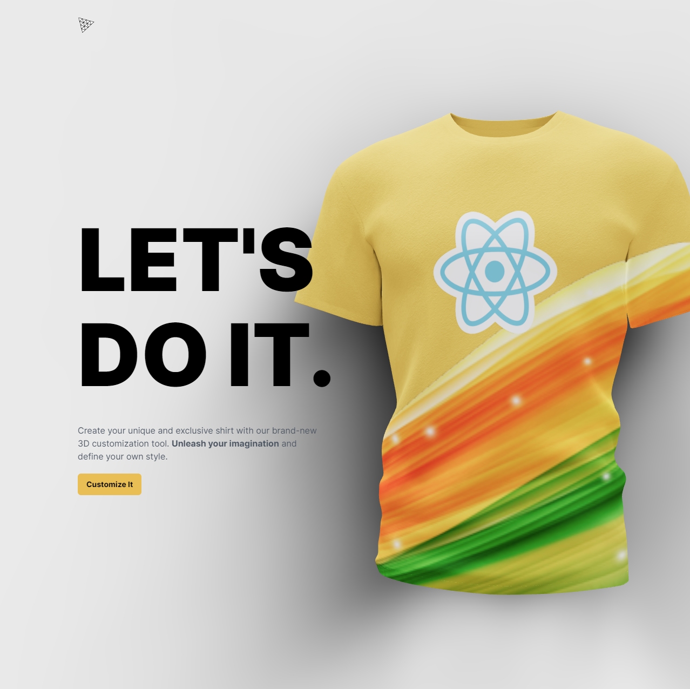
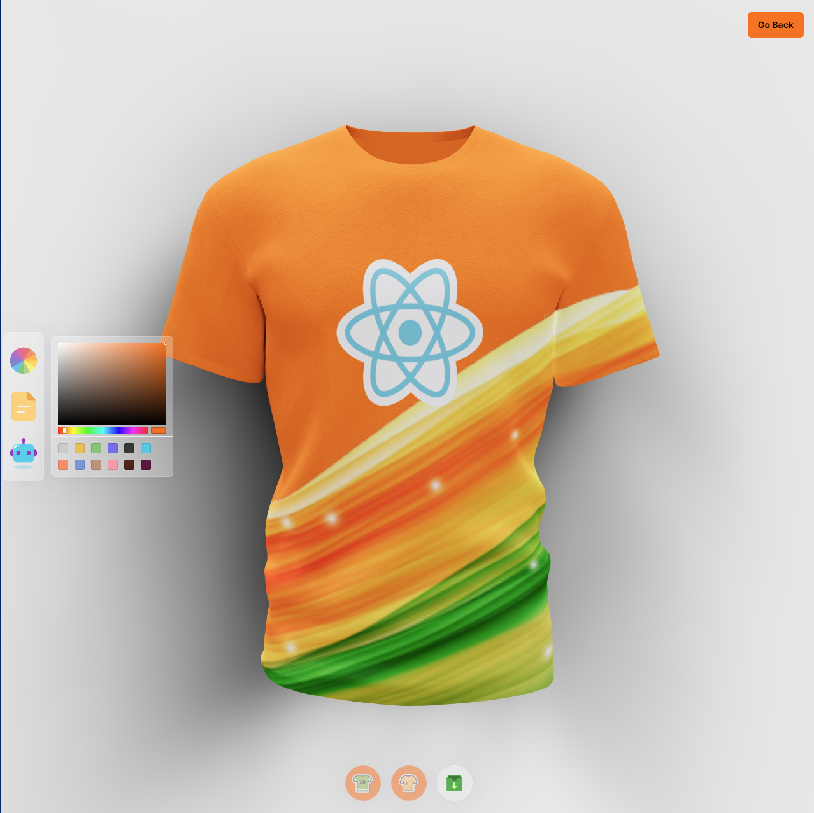

3D Shirt Customizer
===================

[Live Website](https://utkarsh-3d-shirt-customizer.netlify.app/)

The innovative 3D Shirt Customizer offers an immersive experience, utilizing cutting-edge technologies for an unparalleled virtual product customization. Developed with ThreeJS, it harnesses the capabilities of a powerful 3D graphics library to render and animate intricate 3D models. React Three Fiber enriches the environment by seamlessly integrating ThreeJS within React, resulting in stunning 3D graphics. TailwindCSS empowers the project with a streamlined and responsive design framework, while Framer Motion enhances the user experience through captivating animations.

This application facilitates loading, creation and customization of visually appealing 3D models, complete with dynamic lighting and precise camera positioning. By incorporating Higher Order Components (HOCs) and industry-standard practices, the codebase ensures reusability and scalability. The capability to introduce custom colors and file formats adds a personalized touch to the experience.

Leveraging DALLE AI, the application generates and integrates images, enriching the customization process. Users can conveniently download the resulting t-shirt model image, ensuring a tangible outcome of their customization efforts. Furthermore, the application is meticulously designed for responsive performance across various devices, guaranteeing an optimal experience for all users.

In summary, the 3D Shirt Customizer seamlessly blends the capabilities of ThreeJS, React Three Fiber, TailwindCSS and Framer Motion to deliver an engaging and dynamic platform. It empowers users to create, customize, and visualize 3D models with unprecedented realism, making virtual product customization an interactive and visually captivating endeavor.

  
